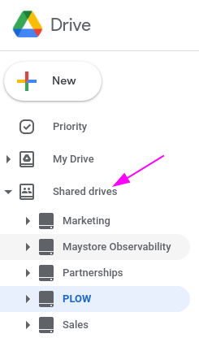
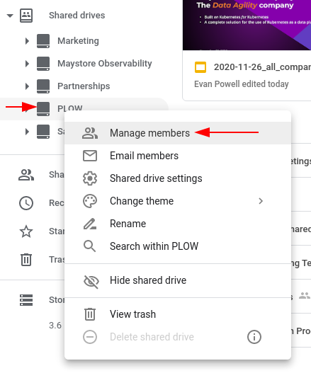
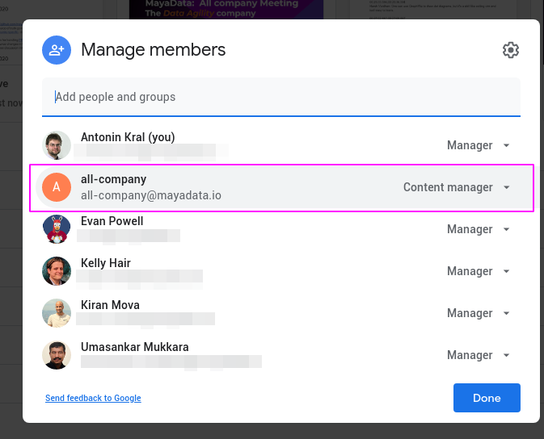

# How To Google Shared Drives 

We have enabled Shared Drives (by upgrading our subscription level at Google Apps). Shared Drive is a cloud incarnation of an office samba shared drive (take the parallel with a grain of salt). Note: Shared Drives used to be called Team Drives, they are the same thing.

> TL;DR -- Use them! ;-)

## What should you do right now
- Create a Shared Drive for your team/project;
- Move previously randomly shared documents there;
- (optional) Take the opportunity to clean up the structure a bit;

## Main benefits of Shared Drives
- **Team-based file ownership** -- is a bigger thing that might seem. Any files stored in a Shared Drive belongs to the team. No individual member can personally claim ownership of any Shared Drive file. In case someone leaves the organization, you do not have to worry about the files stored on this drive, they will stay where they are.
- **Simple discoverability** of the content. When shared on standard Drive, you must either share with particular people or send them a link if shared with a group. Otherwise, they will not see shared content in their drive. This is super simple with Shared Drive as those will show up automatically at the appropriate section: 
- **Simple Team Management** -- sharing, especially internally, is way less cumbersome. You just add people to the particular Shared Drive if they need special treatment. Or leverage groups for automation! 

Please, make sure that **you have added all-company** group at least as a **Contributor** to allow access to the shared drive (obviously doesn't apply to "secret" drives, like HR, customers data etc.): 
